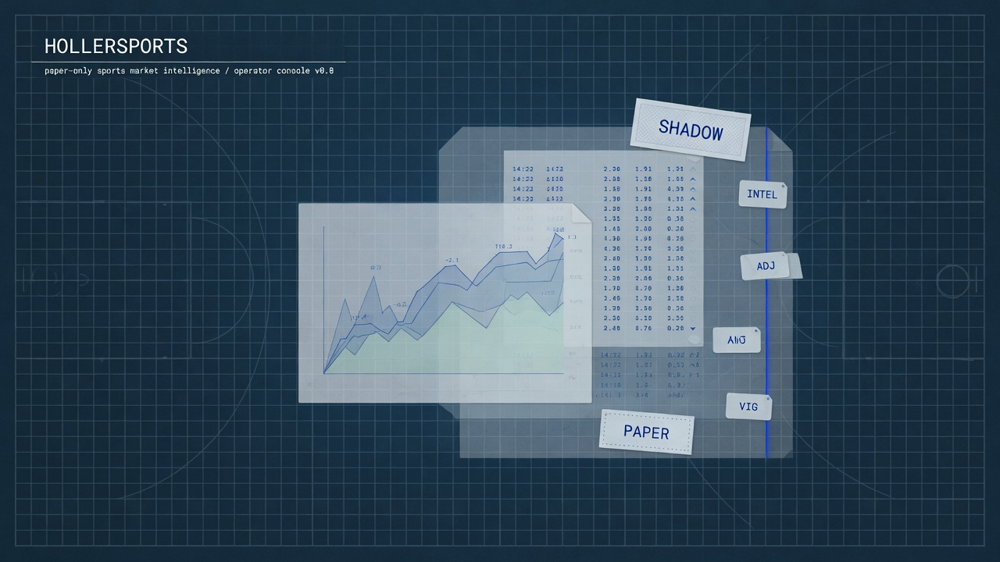

<div align="center">



# HollerSports

> **Paper-only** sports market intelligence operator.\
> Free-first / fixture ingest → market-first strategies → paper portfolio — fail-closed, deterministic, no live capital.

[](https://www.python.org/downloads/)
[](packages/hollersports/pyproject.toml)
[](docs/SYSTEM_CONTRACT.md)
[](docs/SYSTEM_CONTRACT.md)
[](docs/SYSTEM_CONTRACT.md)
[](docs/ABRAXAS_LINEAGE.md)
[](docs/PRODUCTION_READINESS.md)
[](docs/evidence/PRODUCTION_READINESS_ASSESSMENT_2026-08-04.md)
[](LICENSE)

[Quick start](#quick-start) · [Atlas](docs/atlas/HOLLERSPORTS_ATLAS.md) · [Production readiness](docs/PRODUCTION_READINESS.md) · [System contract](docs/SYSTEM_CONTRACT.md) · [Runbook](docs/OPERATOR_RUNBOOK.md) · [Design](docs/superpowers/specs/2026-08-04-hollersports-standalone-design.md)

</div>

---

## Why

Sports market tools often either invent certainty or quietly couple analysis to execution. HollerSports separates the two:

1. **Observe** markets with provenance and source health.  
2. **Propose** strategy candidates (`SHADOW_ONLY`).  
3. **Paper** only after an execution guard — never live books.  
4. **Fail closed** when odds, lines, or provenance are missing.

> Strategies propose. Guards gate. Ledgers remember. Dashboards project. Humans decide.

## Status

**Production:** [NOT READY](docs/PRODUCTION_READINESS.md) for `PAPER_OPERATOR_READY` (see [assessment 2026-08-04](docs/evidence/PRODUCTION_READINESS_ASSESSMENT_2026-08-04.md)). Live capital is **forbidden**, not a readiness goal.

| Track | State | Notes |
|-------|--------|--------|
| Governance + hashing | **shipped** | Authority locks, fail-closed helpers |
| Packet contracts v1 | **shipped** | Nine JSON Schemas + Pydantic |
| Fixture ingest + source health | **shipped** | `fixtures/day001`, multi-league |
| Market-first strategies | **shipped** | Consensus · public fade · CLV; model edge gated off |
| Paper guard + ledger | **shipped** | `PAPER_ONLY`, hash-chained JSONL |
| Settlement / promotion / operator day | **shipped** | Fixture closed loop via `run_operator_day` |
| Golden 12-run + authority locks | **planned** | Plan Task 8 |
| FastAPI + Next.js operator | **planned** | Plan Tasks 7–9 (Workbench / Cobalt) |
| Live capital / books | **forbidden** | System contract |

Full topology: **[docs/atlas/HOLLERSPORTS_ATLAS.md](docs/atlas/HOLLERSPORTS_ATLAS.md)**.

## Architecture (current)

```text
fixtures/day001 ──► source_health ──► MarketIngestionPacket
                                          │
                                          ▼
                              strategy competition
                              (SHADOW_ONLY candidates)
                                          │
                                          ▼
                              execution_guard (PAPER_ONLY)
                                          │
                                          ▼
                              paper ledger → settle → performance
                                          │
                                          ▼
                              promotion (review only) → dashboard projection
```

API + Next.js Workbench UI remain planned (Tasks 7–9).

## Quick start

```bash
git clone https://github.com/scrimshawlife-ctrl/Hollersports.git
cd Hollersports

python3 -m venv .venv && source .venv/bin/activate
pip install -e "packages/hollersports[dev]"

# unit suite (primary package)
pytest tests/ --ignore=hollersports-core -q
```

### Ingest + compete on the fixture day

```python
from pathlib import Path
from hollersports.sources.fixture_adapter import load_fixture_day
from hollersports.pipelines.market_ingestion import run_market_ingestion
from hollersports.pipelines.strategy_competition import run_strategy_competition

day = load_fixture_day(Path("fixtures/day001"))
ingest = run_market_ingestion(day["ingest_payload"])
print(ingest["status"], ingest["authority"])  # INGESTED SHADOW_ONLY

comp = run_strategy_competition(ingest)
print(comp["status"], comp["candidate_count"])
```

### Paper a candidate

Use `hollersports.runes.execution_guard.run_execution_guard` with all gates `True` and `mode` always `PAPER_ONLY`. Append via `hollersports.paper.ledger.append_paper_entry`. See [OPERATOR_RUNBOOK.md](docs/OPERATOR_RUNBOOK.md).

## Package layout

| Path | Role |
|------|------|
| `packages/hollersports/` | Primary Python package (`hollersports` 0.2.0) |
| `schemas/json/` | Canonical `*.v1.schema.json` packet contracts |
| `fixtures/day001/` | Offline multi-league operator day |
| `tests/unit/` | TDD suite for the primary package |
| `docs/atlas/` | Repository atlas |
| `engine/` | Legacy slate isolation engine (migration reference) |
| `hollersports-core/` | Legacy feedback loop package |

## Day-one leagues

Architecture is multi-sport. Fixture pack and design day-one set:

**NBA · NFL · MLB · NHL · EPL · MLS** — markets v1: moneyline, spread, total.

## Documentation atlas

| Doc | Contents |
|-----|----------|
| **[docs/atlas/HOLLERSPORTS_ATLAS.md](docs/atlas/HOLLERSPORTS_ATLAS.md)** | Topology, surfaces, OBSERVED vs PLANNED |
| **[docs/SYSTEM_CONTRACT.md](docs/SYSTEM_CONTRACT.md)** | Ten non-negotiable laws |
| **[docs/ABRAXAS_LINEAGE.md](docs/ABRAXAS_LINEAGE.md)** | Concept-only lineage — no Abraxas install |
| **[docs/OPERATOR_RUNBOOK.md](docs/OPERATOR_RUNBOOK.md)** | Fixture operator day |
| **[docs/superpowers/specs/2026-08-04-hollersports-standalone-design.md](docs/superpowers/specs/2026-08-04-hollersports-standalone-design.md)** | Approved product design |
| **[docs/superpowers/plans/2026-08-04-hollersports-standalone-operator.md](docs/superpowers/plans/2026-08-04-hollersports-standalone-operator.md)** | Implementation plan (Tasks 1–10) |
| **[INTEGRATION_GUIDE.md](INTEGRATION_GUIDE.md)** | Legacy slate-engine integration notes |

## Governance seals

```text
CAPITAL_AUTHORITY=false
EXECUTION_AUTHORITY=false
LIVE_BOOKS=false
ABRAXAS_RUNTIME_REQUIRED=false
MODE=PAPER_ONLY
```

## Development

```bash
# focused tests
pytest tests/unit/test_governance.py -v
pytest tests/unit/ -q --ignore=hollersports-core

# editable install from packages/
pip install -e "packages/hollersports[dev]"
```

Implementation workstream: feature branch / plan Tasks 6–10 (settlement loop, API, Cobalt workbench UI, docs polish).

## License

Apache License 2.0 — see [LICENSE](LICENSE).

## Disclaimer

HollerSports is an **analysis and paper-simulation** tool. It does not place wagers, move capital, or guarantee predictive accuracy. Sports wagering may be restricted or illegal in your jurisdiction; you are responsible for compliance.
